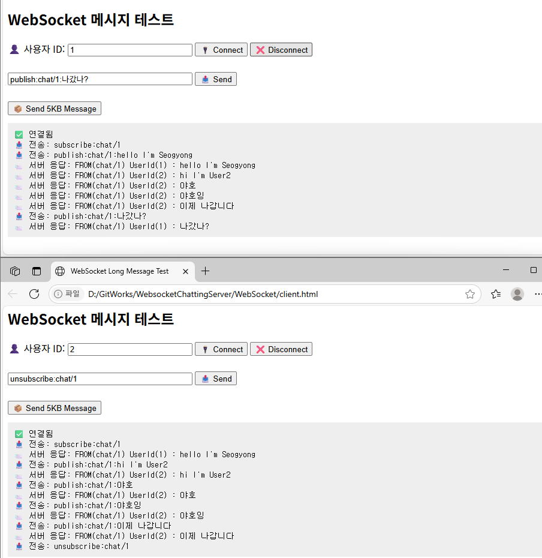

# C# ChattingServer
1. WebSocket
2. Socket


---
## WebSocket
C# ASP.Net 서버에서 WebSocket 기반 채팅 또는 알림 서비스를 구성함. 
<br>멀티 인스턴스 환경에서 Redis Pub/Sub를 사용해 서버 간 메시지를 중계하는 구조

```
1. Server → Redis (Subscribe)
2. Client → Server(WebSocket) → Redis (Publish)
3. Redis → All Servers → Connected Clients
```


| 구성 요소         | 역할 |
|------------------|------|
| **Client**       | WebSocket을 통해 서버에 연결 |
| **WebSocket Server** | Redis에 메시지를 `PUBLISH`, Redis 메시지를 `SUBSCRIBE` |
| **Redis**        | 메시지 브로커 (Pub/Sub 시스템) |
| **Redis 채널**   | `chat/room1`, `user/123` 등 주제 기반 메시지 구분 |


실행

<br>
TODO: 멀티스레드 고려

## Socket
TODO: 구현중


## Redis PUB/SUB
1. 구독중인 채널 보기
```
PUBSUB CHANNELS

127.0.0.1:6379> PUBSUB CHANNELS
1) "chat/world"
2) "chat/guild"
```

2. 채널에 연결된 Subscriber 수 보기
```
PUBSUB NUMSUB channel1 channel2 ...
127.0.0.1:6379> PUBSUB NUMSUB chat/world chat/guild
1) "chat/world"
2) (integer) 3
3) "chat/guild"
4) (integer) 1
```

3. 패턴 기반 구독
```
PSUBSCRIBE <pattern>
```

4. 메시지 발행
```
PUBLISH chat/world "Hello subscribers!"
```
